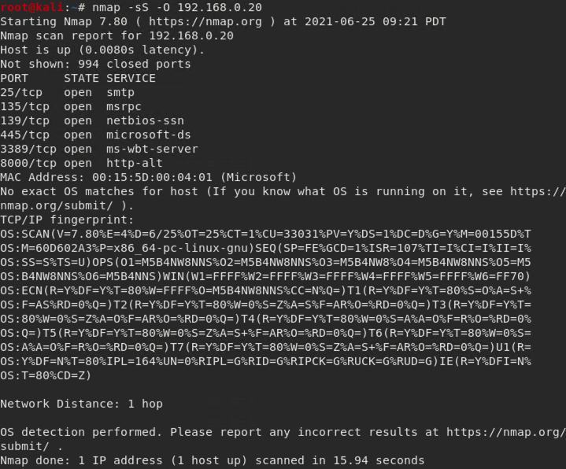
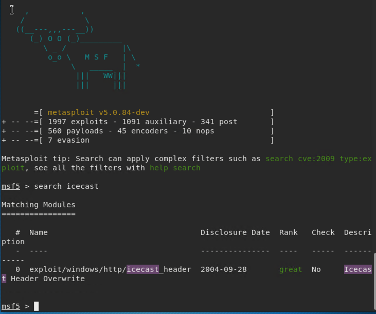
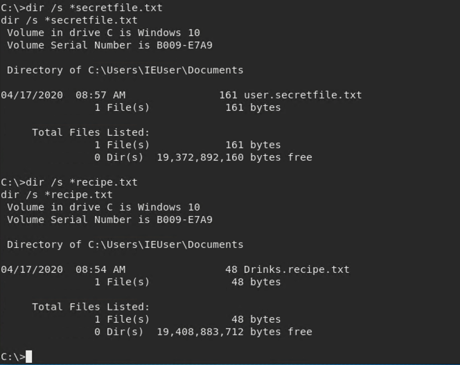
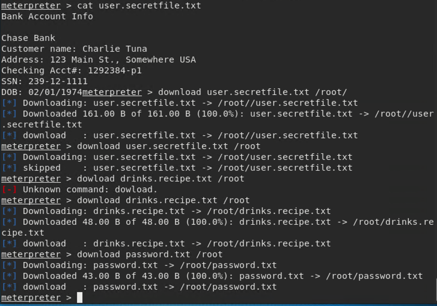
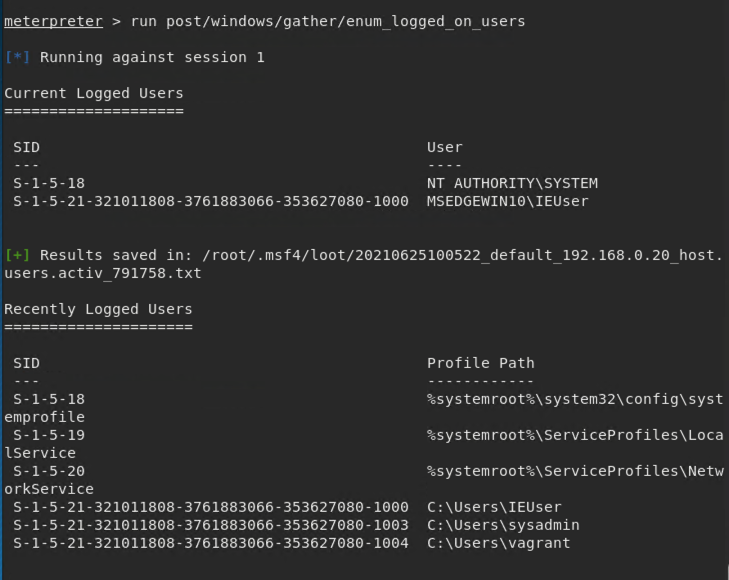
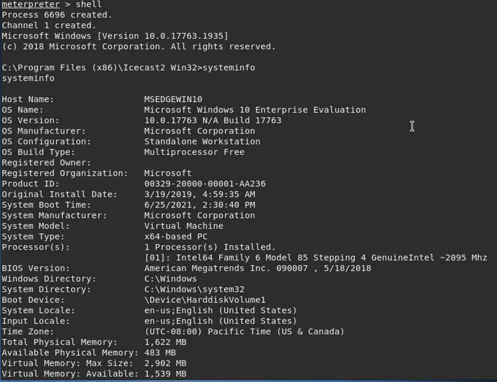

# GoodSecurity Penetration Test Report 

## Michael.McFall@GoodSecurity.com

### DATE:06/25/2021
---

## **1.	High-Level Summary**

GoodSecurity was tasked with performing an internal penetration test on GoodCorp’s CEO, Hans Gruber. 
An internal penetration test is a dedicated attack against internally connected systems. 
The goal of this test is to perform attacks similar to those of a hacker and attempt to infiltrate Hans’ computer to determine if it is at risk. 
GoodSecurity’s overall objective was to exploit any vulnerable software, find a secret recipe file on Hans’ computer, and report the findings back to GoodCorp.
The internal penetration test found several alarming vulnerabilities on Hans’ computer: 
When performing the attacks, GoodSecurity was able to gain access to his machine and find the secret recipe file by exploiting two programs with major vulnerabilities. 
The details of the attack are below.

---

## **2.	Findings**

Machine IP:192.168.0.20

Hostname:MSEDGEWIN10

Vulnerability Exploited:Icecast Header Overwrite

### **Vulnerability Explanation:**

This vunerability works on Icecast versions of 2.0.1 and earlier.  
It exploits a buffer overflow in the header parsing by sending 32 HTTP headers, 
writing one past the end of the pointer array.

### **Severity:**

This is highly severe and enabled direct access to files on the machine that were able to be exfiltrated.

---

### **Proof of Concept:**

---
First, I did an NMAP scan on the target machine at 192.168.0.20. The results show that port 8000 is open.

---
Next, I searched for the latest exploits for Icecast

---
At this point, I switched to Metasploit and searched for an Icecast exploit.
---

---
I loaded a Header Overwrite exploit for Icecast and set the RHOST field to 192.168.0.20.
I ran the exploit and it was succesful, resulting in a Metaterpreter session with the remote host.
---

---
I began a search on the remote Windows host for the target files.  After locating them
I began the download to my local machine.
---

---

---
I was also able to identify three addtional exploits that were available. 

---
Additional users were identified that were logged on.
---

---
I was also able to pull System Information for the target host.

---

## **3.	Recommendations**

Based on the vulnerabilties uncovered, I reccomend that Icecast Server be removed from the CEO's 
workstation and moved to another server where it will be updated centrally on a regular schedule.
Updates should be deployed on a regular schedule to keep all servers and workstations up to date.

